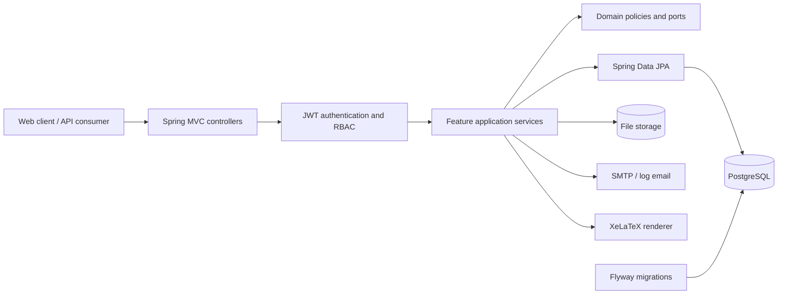

# CV Management Backend

[](https://github.com/UOR-Internship-Management-System/backend/actions/workflows/ci.yml)
[](https://github.com/UOR-Internship-Management-System/backend/actions/workflows/code-quality.yml)
[](https://openjdk.org/projects/jdk/21/)
[](https://spring.io/projects/spring-boot)
[](https://www.postgresql.org/)
[](https://www.openapis.org/)

The backend service for the **CV Management and Deterministic Internship Candidate Filtering System**, developed for the Department of Computer Science, University of Ruhuna.

It provides a secure REST API for student onboarding, profile and portfolio management, official academic records, ATS-oriented CV generation, internship-request administration, deterministic candidate filtering, manual shortlist management, exports, and auditable system operations.

> [!IMPORTANT]
> This is the backend repository. The frontend is maintained separately in the organisation's frontend repository.

## Table of contents

- [Overview](#overview)
- [Features](#features)
- [Technology stack](#technology-stack)
- [Architecture](#architecture)
- [Getting started](#getting-started)
- [Configuration](#configuration)
- [API overview](#api-overview)
- [Database and migrations](#database-and-migrations)
- [File processing and background jobs](#file-processing-and-background-jobs)
- [Testing](#testing)
- [Docker](#docker)
- [Project structure](#project-structure)
- [Scripts and automation](#scripts-and-automation)
- [Operations and troubleshooting](#operations-and-troubleshooting)
- [Contributing](#contributing)
- [Security](#security)
- [License](#license)

## Overview

The system supports two authenticated user types:

- **Student** — verifies an eligible university identity, manages a profile and supporting records, declares skills, maintains projects, views official results and GPA, previews a CV, and saves/downloads an active PDF CV.
- **Administrator** — manages companies and internship requests, imports official academic ledgers, inspects registered students, runs deterministic candidate filters, builds and finalizes shortlists, and creates CSV/ZIP exports.

The application intentionally uses deterministic, explainable criteria. It does **not** perform AI scoring, candidate ranking, match-percentage calculation, or automatic final selection.

## Features

### Identity and access

- Eligible-student verification by index number and university email.
- OTP verification, expiry, resend cooldowns, and attempt limits.
- Separate student and administrator login flows.
- OTP-based password recovery.
- Stateless JWT bearer authentication and role-based access control.
- BCrypt password hashing and security-event auditing.

### Student workspace

- Dashboard metrics.
- Personal details, contact links, and professional links.
- Profile-photo and certificate-evidence uploads with content policies.
- Certificates, awards, activities, and work experience.
- Taxonomy-backed skills and competency levels.
- Project portfolio with linked skills.
- Read-only official academic records and calculated GPA.
- CV source-freshness reporting, preview, save, and PDF download.

### Administration and internship workflow

- Administrator dashboard metrics.
- CSV academic-ledger upload, validation, staging inspection, and commit.
- Read-only student inspection, including latest saved CVs.
- Company and internship-request CRUD.
- Taxonomy-backed required skills.
- Persisted deterministic filtering using current official GPA and declared skills.
- Manual shortlist creation, candidate management, and conflict-aware finalization.
- Asynchronous shortlist-summary CSV and latest-CV ZIP exports.

### Platform capabilities

- PostgreSQL persistence and Flyway schema migrations.
- Optimistic concurrency using strong `ETag` and `If-Match` headers.
- Correlation IDs and structured API errors.
- Audit-event persistence and operational metrics.
- Health checks for the application, database, and migration state.
- File storage for academic imports, profile assets, CVs, and exports.

## Technology stack

| Area | Technology |
|---|---|
| Language/runtime | Java 21 |
| Framework | Spring Boot 4.1.0 |
| API | Spring Web MVC, Jakarta Validation, Jackson |
| Security | Spring Security, JWT, BCrypt, RBAC |
| Persistence | Spring Data JPA / Hibernate |
| Database | PostgreSQL 16 |
| Migrations | Flyway |
| CSV | Apache Commons CSV |
| Email | Spring Mail, SMTP, development log mode |
| PDF generation | XeLaTeX with a backend-owned ATS template |
| Testing | JUnit, Spring Boot Test, H2, Testcontainers |
| Contract | OpenAPI 3.1.1 |
| Build | Maven Wrapper |
| Containers | Docker and Docker Compose |
| CI | GitHub Actions |

## Architecture

The service is a **modular monolith** organized by business capability. It retains the deployment and transactional simplicity of one Spring Boot application while enforcing explicit module ownership.



Feature modules normally follow this shape:

```text
modules/<feature>/
├── api/           # Controllers and request/response DTOs
├── application/   # Use-case orchestration
├── domain/        # Policies, models, exceptions, and ports
├── mapper/        # Boundary/model conversion
└── persistence/   # Entities, repositories, queries, and projections
```

Cross-cutting code lives in `config`, `infrastructure`, and `shared`. See [`docs/architecture`](docs/architecture) for boundaries and dependency rules, and [`docs/adr`](docs/adr) for Architecture Decision Records.

## Getting started

### Prerequisites

- Java Development Kit **21**
- Docker Engine and Docker Compose v2
- Git
- XeLaTeX on `PATH` for local PDF generation

Maven does not need to be installed separately; the Maven Wrapper is included. The production Docker image includes TeX Live/XeLaTeX. Without XeLaTeX, the API starts but CV PDF generation fails.

### 1. Clone the repository

```bash
git clone https://github.com/UOR-Internship-Management-System/backend.git
cd backend
```

### 2. Prepare local configuration

Safe local defaults are provided. Copy the example file if you want explicit local configuration:

```bash
cp .env.example .env
```

PowerShell:

```powershell
Copy-Item .env.example .env
```

Docker Compose reads `.env` automatically. Spring Boot does not automatically import arbitrary `.env` files when launched directly, so place overridden values in the shell or IDE run configuration. Never commit `.env` or real secrets.

### 3. Start PostgreSQL

```bash
docker compose -f docker/docker-compose.dev.yml up -d
docker compose -f docker/docker-compose.dev.yml ps
```

This starts PostgreSQL 16 on `localhost:5432`, creates `cv_management`, and uses the persistent `cv_management_postgres_data` volume.

### 4. Run the backend

Linux/macOS/Git Bash:

```bash
./mvnw spring-boot:run -Dspring-boot.run.profiles=local
```

Windows PowerShell:

```powershell
.\mvnw.cmd spring-boot:run "-Dspring-boot.run.profiles=local"
```

`local` is the default profile. On first startup, Flyway applies pending migrations before the API accepts traffic.

### 5. Verify health

```bash
curl http://localhost:8080/api/v1/health
curl http://localhost:8080/actuator/health
```

Example application health response:

```json
{
  "status": "UP",
  "service": "cv-management-backend",
  "timestamp": "2026-01-01T00:00:00Z",
  "database": "UP",
  "appliedMigrations": 56
}
```

The migration count changes as the schema evolves.

### 6. Stop local services

```bash
docker compose -f docker/docker-compose.dev.yml down
```

To permanently discard the local database volume:

```bash
docker compose -f docker/docker-compose.dev.yml down -v
```

## Configuration

Base configuration is in [`application.yml`](src/main/resources/application.yml), with `local`, `dev`, `test`, and `prod` profile files alongside it.

### Profiles

| Profile | Purpose | Notes |
|---|---|---|
| `local` | Developer workstation | `CV_DB_*` defaults, detailed authorized health, out-of-order Flyway enabled |
| `dev` | Shared development | `CV_DB_*`, application debug logging |
| `test` | Automated tests | H2 where suitable and PostgreSQL Testcontainers for integration coverage |
| `prod` | Production | Explicit `DATABASE_*`, JWT, SMTP, origin, and public URL required |

### Core environment variables

| Variable | Default | Description |
|---|---|---|
| `SERVER_PORT` | `8080` | HTTP port |
| `SPRING_PROFILES_ACTIVE` | `local` | Active profile |
| `CV_DB_HOST` | `localhost` | Local/development PostgreSQL host |
| `CV_DB_PORT` | `5432` | Local/development PostgreSQL port |
| `CV_DB_NAME` | `cv_management` | Local/development database |
| `CV_DB_USERNAME` | `cv_user` | Local/development database user |
| `CV_DB_PASSWORD` | `cv_local_password` | Local/development password |
| `DATABASE_URL` | — | Production JDBC URL |
| `DATABASE_USERNAME` | — | Production database user |
| `DATABASE_PASSWORD` | — | Production database password |
| `FRONTEND_ORIGIN` | `http://localhost:5173` | Allowed CORS origin(s), comma-separated |
| `PUBLIC_BASE_URL` | `http://localhost:8080` | Base URL used in public file links |

### JWT and OTP

| Variable | Default | Description |
|---|---|---|
| `JWT_SECRET` | Local placeholder | Token-signing secret; replace outside local development |
| `JWT_ISSUER` | `cv-management` | Token issuer |
| `JWT_ACCESS_TOKEN_TTL` | `PT30M` | Access-token lifetime |
| `JWT_REFRESH_TOKEN_TTL` | `P7D` | Refresh-token lifetime |
| `APP_AUTH_OTP_LENGTH` | `6` | OTP length |
| `APP_AUTH_OTP_TTL` | `PT5M` | OTP lifetime |
| `APP_AUTH_OTP_MAX_ATTEMPTS` | `3` | Maximum verification attempts |
| `APP_AUTH_OTP_RESEND_COOLDOWN` | `PT60S` | Resend delay |
| `APP_AUTH_OTP_MAX_RESENDS` | `3` | Maximum resends |

Durations use ISO-8601 notation: `PT30M` is 30 minutes and `P7D` is seven days.

### Email

| Variable | Default | Description |
|---|---|---|
| `APP_EMAIL_MODE` | `log` | `log` for development or `smtp` for delivery |
| `APP_EMAIL_FROM` | `no-reply@cvmanagement.local` | Sender address |
| `SMTP_HOST` | — | SMTP host |
| `SMTP_PORT` | `587` | SMTP port |
| `SMTP_USERNAME` | — | SMTP username |
| `SMTP_PASSWORD` | — | SMTP password |

Development log mode writes OTPs to the application log. Never use it in production. The `prod` profile forces authenticated STARTTLS SMTP.

### Storage and workers

| Variable | Default | Description |
|---|---|---|
| `ACADEMIC_LEDGER_STORAGE_ROOT` | `./data/academic-ledger` | Ledger upload root |
| `ACADEMIC_LEDGER_MAX_FILE_SIZE_BYTES` | `5242880` | 5 MiB domain limit |
| `ACADEMIC_LEDGER_WORKER_ENABLED` | `true` | Enable ledger processing |
| `ACADEMIC_LEDGER_WORKER_POLL_DELAY_MS` | `2000` | Ledger poll delay |
| `CV_STORAGE_ROOT` | `./data/cv` | Generated CV root |
| `CV_LATEX_COMMAND` | `xelatex` | XeLaTeX command/path |
| `CV_LATEX_TIMEOUT` | `PT10S` | Compilation timeout |
| `CV_PDF_MAX_BYTES` | `5242880` | Maximum PDF size |
| `CV_PDF_MAX_CONCURRENT` | `2` | Concurrent generation limit |
| `CV_PREVIEW_TTL` | `PT15M` | Preview lifetime |
| `EXPORT_STORAGE_ROOT` | `./data/exports` | Export root |
| `EXPORT_WORKER_ENABLED` | `true` | Enable export processing |
| `EXPORT_WORKER_POLL_DELAY_MS` | `2000` | Export poll delay |
| `EXPORT_RETENTION` | `P7D` | Export retention |

See [`.env.example`](.env.example) and the YAML files for cleanup, retry, batching, and GPA-rounding controls.

## API overview

All business endpoints are versioned below:

```text
http://localhost:8080/api/v1
```

The canonical contract is [`docs/api/CV_Management_API_OpenAPI_v1.6.0.yaml`](docs/api/CV_Management_API_OpenAPI_v1.6.0.yaml). A synchronized runtime copy is kept in [`src/main/resources/openapi`](src/main/resources/openapi).

> [!NOTE]
> The OpenAPI document represents the complete approved Version 1 contract and may contain reserved operations before their controller is activated. Audit events are persisted, for example, while the administrator audit-query controller remains a reserved boundary. Use controller tests and feature release evidence to judge deployment readiness for an individual operation.

### Public endpoints

| Route | Purpose |
|---|---|
| `GET /api/v1/health` | Application, database, and migration health |
| `GET /actuator/health` | Spring Boot health probe |
| `POST /api/v1/student-verifications` | Start student verification |
| `POST /api/v1/student-verifications/{id}/otp/verify` | Verify onboarding OTP |
| `POST /api/v1/student-verifications/{id}/otp/resend` | Resend onboarding OTP |
| `POST /api/v1/student-verifications/{id}/password` | Create student password |
| `POST /api/v1/auth/student/login` | Student login |
| `POST /api/v1/auth/admin/login` | Administrator login |
| `/api/v1/password-resets/**` | Password recovery |
| `GET /api/v1/files/{fileAssetId}/content` | Token-validated file content |

### Student route groups

| Base route | Purpose |
|---|---|
| `/api/v1/auth/me` | Current account |
| `/api/v1/auth/logout` | Logout/token invalidation |
| `/api/v1/me/dashboard/metrics` | Dashboard summary |
| `/api/v1/me/profile` | Profile and supporting records |
| `/api/v1/me/profile/photo` | Profile photo |
| `/api/v1/me/profile/certificates/{id}/evidence` | Certificate evidence |
| `/api/v1/skill-taxonomy` | Taxonomy, clusters, categories, skills |
| `/api/v1/me/declared-skills` | Declared skills |
| `/api/v1/me/projects` | Project portfolio |
| `/api/v1/me/academic-records` | Official results and GPA |
| `/api/v1/me/cv` | CV freshness, preview, save, download |

### Administrator route groups

| Base route | Purpose |
|---|---|
| `/api/v1/admin/dashboard/metrics` | Dashboard summary |
| `/api/v1/admin/academic-ledger/uploads` | Ledger workflow |
| `/api/v1/admin/academic-records` | Academic-record queries |
| `/api/v1/admin/students` | Student inspection |
| `/api/v1/admin/companies` | Company management |
| `/api/v1/admin/internship-requests` | Internship requests and required skills |
| `/api/v1/admin/candidate-filtering/runs` | Deterministic filtering |
| `/api/v1/admin/shortlists` | Shortlists and finalization |
| `/api/v1/admin/exports` | CSV/ZIP export jobs |

Schemas, pagination, validation, conditional headers, operation IDs, and endpoint-specific errors are documented in OpenAPI. Integration collections and environments are under [`postman`](postman).

### Authentication and authorization

The API is stateless. Send the access token with protected requests:

```http
Authorization: Bearer <access-token>
```

- `/api/v1/me/**` requires `STUDENT`.
- `/api/v1/admin/**` requires `ADMIN`.
- Onboarding, login, password reset, health, and tokenized file routes are public.
- CSRF is disabled because no server-side browser session is used.
- CORS allows configured origins and `GET`, `POST`, `PUT`, `PATCH`, `DELETE`, and `OPTIONS`.

Backend authorization is authoritative; frontend route guards are only a user-experience aid.

### Tracing, errors, and concurrency

- Clients may send `X-Correlation-Id`; otherwise the backend creates one.
- Responses expose `X-Correlation-Id` for log correlation.
- Validation and application failures return structured errors rather than stack traces.
- Authentication failures return `401`; authorization failures return `403`.
- Mutable versioned resources return an `ETag` such as `"3"`. Send it as `If-Match` on the next mutation. Missing preconditions can return `428`; stale versions can return `412` or the endpoint's documented conflict response.

## Database and migrations

PostgreSQL is the target database and **Flyway is the only schema authority**.

- Migrations: [`src/main/resources/db/migration`](src/main/resources/db/migration)
- PostgreSQL bootstrap: [`docker/postgres/init`](docker/postgres/init)
- Runbook: [`docs/runbook/database-migrations.md`](docs/runbook/database-migrations.md)

Hibernate uses `ddl-auto: validate`: it validates mappings but does not create or modify runtime tables. Never edit an already-applied shared migration; add a new versioned migration.

Flyway runs automatically at application startup. The helper below starts PostgreSQL and triggers the local migration path:

```bash
./scripts/migrate-local.sh
```

The schemas cover authentication, student identity/profile data, skills, academic staging and official records, CV metadata, companies, internship requests, filtering, shortlists, export jobs, files, and audit events.

## File processing and background jobs

### Academic ledger

Academic data enters through a controlled administrator CSV workflow:

1. upload a UTF-8 CSV with the required ordered headers;
2. validate and stage its rows asynchronously;
3. inspect staged rows and validation results;
4. atomically commit a valid upload to official records.

The domain limit is 5 MiB. Duplicate active/committed content is rejected, and invalid uploads do not modify official results.

### CV generation

The backend assembles approved data, applies the ATS template in [`src/main/resources/templates/cv`](src/main/resources/templates/cv), invokes XeLaTeX with timeout/concurrency limits, validates the output, and stores the PDF. Previews expire, and freshness metadata reports whether a saved CV is behind its source profile, skills, projects, or academic data.

### Exports

Shortlist CSVs and bulk latest-CV ZIPs run as background jobs. A client creates a job, polls its state, and downloads the artifact when ready. Worker behavior and retention are configurable.

## Testing

Run the suite:

```bash
./mvnw -B test
```

Windows:

```powershell
.\mvnw.cmd -B test
```

Package the application:

```bash
./mvnw -B package
```

Build without rerunning tests:

```bash
./mvnw -B package -DskipTests
```

Coverage includes application startup, controllers and HTTP contracts, authentication/authorization, OTP policies, validation, services, repositories, PostgreSQL integration, empty-database Flyway migration, architecture rules, scope guardrails, files, academic ledgers, CV generation, filtering, shortlists, exports, and auditing.

Docker must be running for Testcontainers-backed tests. Postman suites and release evidence are under [`postman`](postman), and the testing strategy is under [`docs/testing`](docs/testing).

Check the canonical OpenAPI copies:

```bash
./scripts/validate-openapi.sh
```

## Docker

Start the persistent development database:

```bash
docker compose -f docker/docker-compose.dev.yml up -d
```

Start the disposable test database on port `5433`:

```bash
docker compose -f docker/docker-compose.test.yml up -d
```

The test database uses `tmpfs`; its contents disappear when stopped.

Build the application image:

```bash
docker build -f docker/Dockerfile -t cv-management-backend .
```

The multi-stage image builds with Java 21, installs XeLaTeX and fonts, runs as non-root `appuser`, exposes port `8080`, and does not bake in secrets.

Run it against the development database:

```bash
docker run --rm -p 8080:8080 \
  -e SPRING_PROFILES_ACTIVE=local \
  -e CV_DB_HOST=host.docker.internal \
  -e CV_DB_PORT=5432 \
  -e CV_DB_NAME=cv_management \
  -e CV_DB_USERNAME=cv_user \
  -e CV_DB_PASSWORD=cv_local_password \
  -e JWT_SECRET=replace-with-a-long-local-development-secret \
  -e APP_EMAIL_MODE=log \
  -v cv_management_files:/app/data \
  cv-management-backend
```

On Linux, use a database hostname reachable from the container or add an appropriate host mapping.

## Project structure

```text
backend/
├── .github/workflows/        # CI and validation
├── .mvn/                     # Maven Wrapper support
├── data/                     # Local runtime file roots
├── docker/                   # Dockerfile, Compose, PostgreSQL bootstrap
├── docs/
│   ├── adr/                  # Architecture decisions
│   ├── api/                  # OpenAPI contracts
│   ├── architecture/         # Boundaries and dependency rules
│   ├── operations/           # Operational guidance
│   ├── runbook/              # Deployment, migration, rollback, monitoring
│   └── testing/              # Strategy and reports
├── postman/                  # Collections and release evidence
├── scripts/                  # Development and verification helpers
├── src/
│   ├── main/
│   │   ├── java/.../{config,infrastructure,modules,shared}/
│   │   └── resources/{db,openapi,templates}/
│   └── test/                 # Unit, contract, integration, architecture tests
├── .env.example
├── pom.xml
├── mvnw / mvnw.cmd
└── README.md
```

## Scripts and automation

| Script | Purpose |
|---|---|
| `scripts/dev-start.sh` | Start PostgreSQL and the local application |
| `scripts/dev-stop.sh` | Stop the development Compose stack |
| `scripts/run-tests.sh` | Run Maven tests |
| `scripts/migrate-local.sh` | Start PostgreSQL and run local Flyway startup |
| `scripts/validate-openapi.sh` | Verify OpenAPI version and synchronized copies |
| `scripts/verify-sprint1-closure.*` | Historical foundation-verification scripts |
| `scripts/db/*.sql` | Release preflight and database verification |

Postman feature folders also contain Unix and PowerShell Newman runners.

GitHub Actions runs for pull requests and pushes to `main`, `develop`, `feature/**`, and `codex/**`:

| Workflow | Checks |
|---|---|
| Backend CI | Tests and package build |
| Code Quality | Main/test compilation and workflow validation |
| Dependency Check | Maven dependency resolution and dependency tree |

Recommended pre-push checks:

```bash
./mvnw -B test
./mvnw -B package -DskipTests
docker compose -f docker/docker-compose.dev.yml config
docker compose -f docker/docker-compose.test.yml config
./scripts/validate-openapi.sh
```

## Operations and troubleshooting

### Production requirements

Use `SPRING_PROFILES_ACTIVE=prod` and supply:

- `DATABASE_URL`, `DATABASE_USERNAME`, and `DATABASE_PASSWORD`;
- a strong `JWT_SECRET` and expected `JWT_ISSUER`;
- `FRONTEND_ORIGIN` and `PUBLIC_BASE_URL`;
- SMTP sender, host, port, username, and password;
- persistent storage for CVs, academic ledgers, exports, and profile files.

Terminate TLS at a trusted proxy/load balancer, restrict database access, rotate secrets, back up PostgreSQL and files together, and test migration and rollback procedures. See [`docs/runbook`](docs/runbook) for deployment, monitoring, incident response, rollback, and CV-generation guidance.

### Health and observability

- `GET /actuator/health` supports platform probes.
- `GET /api/v1/health` checks the database and reports applied migrations.
- Application timestamps and persistence use UTC.
- Correlation IDs are included in response headers and logging context.
- Production health output hides internal details.
- Audit operations are documented in [`docs/operations/BMD-012-audit-operations-runbook.md`](docs/operations/BMD-012-audit-operations-runbook.md).

### Database connection failure

```bash
docker compose -f docker/docker-compose.dev.yml ps
docker compose -f docker/docker-compose.dev.yml logs postgres
```

Confirm port `5432` is free and `CV_DB_*` values match Compose.

### Flyway or Hibernate validation failure

Do not switch Hibernate to schema creation. Inspect the migration history and startup error. For **disposable local data only**, `docker compose -f docker/docker-compose.dev.yml down -v` rebuilds the database on the next start. Never do this to shared or production data.

### XeLaTeX unavailable

```bash
xelatex --version
```

Install XeLaTeX, run the Docker image, or point `CV_LATEX_COMMAND` to the executable.

### OTP not received locally

Set `APP_EMAIL_MODE=log` and inspect application logs. SMTP requires valid credentials and connectivity. Log mode is development-only.

### Testcontainers cannot start

Start Docker Desktop/Engine and ensure the current user can access the Docker daemon.

### Port 8080 is occupied

```bash
SERVER_PORT=8081 ./mvnw spring-boot:run -Dspring-boot.run.profiles=local
```

PowerShell:

```powershell
$env:SERVER_PORT = "8081"
.\mvnw.cmd spring-boot:run "-Dspring-boot.run.profiles=local"
```

## Contributing

Read [`CONTRIBUTING.md`](CONTRIBUTING.md) before opening a pull request. Work branches are created from `develop` using `feature/`, `fix/`, `chore/`, or `hotfix/` conventions.

Use conventional-style commits:

```text
<type>(<scope>): <short summary>
```

Examples:

```text
feat(cv): add source freshness endpoint
fix(auth): enforce OTP resend cooldown
test(shortlists): cover stale finalization version
docs(api): clarify export polling contract
```

Add tests for behavior changes, keep OpenAPI copies synchronized, and preserve the reduced-scope guardrails.

## Security

Do not disclose suspected vulnerabilities in a public issue. Follow [`SECURITY.md`](SECURITY.md).

Never commit database/SMTP credentials, JWT secrets, `.env` files, OTPs, tokens, password hashes, student data, generated CVs, ledger uploads, or exports.

## License

Copyright © 2026 University of Ruhuna, Department of Computer Science.

This repository is proprietary and all rights are reserved. Unauthorized copying, distribution, modification, or use is prohibited without prior written permission. See [`LICENSE`](LICENSE).
